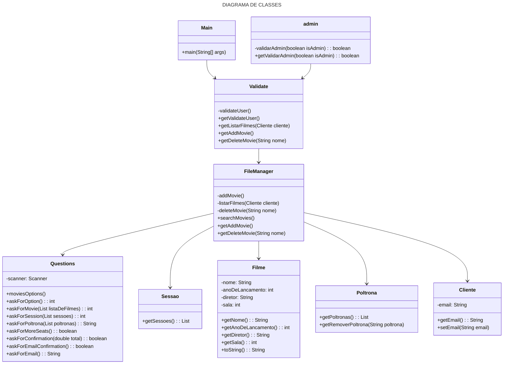

# Gerenciamento de Cinema

```mermaid
---
title: DIAGRAMA DE CLASSES
---
classDiagram
    class Main {
        +main(String[] args)
    }
    class Validate {
        -validateUser()
        +getValidateUser()
        +getListarFilmes(Cliente cliente)
        +getAddMovie()
        +getDeleteMovie(String nome)
    }
    class FileManager {
        -addMovie()
        -listarFilmes(Cliente cliente)
        -deleteMovie(String nome)
        +searchMovies()
        +getAddMovie()
        +getDeleteMovie(String nome)
    }
    class Questions {
        -scanner: Scanner
        +moviesOptions()
        +askForOption(): int
        +askForMovie(List<Filme> listaDeFilmes): int
        +askForSession(List<String> sessoes): int
        +askForPoltrona(List<String> poltronas): String
        +askForMoreSeats(): boolean
        +askForConfirmation(double total): boolean
        +askForEmailConfirmation(): boolean
        +askForEmail(): String
    }
    class Sessao {
        +getSessoes(): List<String>
    }
    class Filme {
        -nome: String
        -anoDeLancamento: int
        -diretor: String
        -sala: int
        +getNome(): String
        +getAnoDeLancamento(): int
        +getDiretor(): String
        +getSala(): int
        +toString(): String
    }
    class Poltrona {
        +getPoltronas(): List<String>
        +getRemoverPoltrona(String poltrona)
    }
    class Cliente {
        -email: String
        +getEmail(): String
        +setEmail(String email)
    }
    class admin {
        -validarAdmin(boolean isAdmin): boolean
        +getValidarAdmin(boolean isAdmin): boolean
    }

    Main --> Validate
    Validate --> FileManager
    FileManager --> Questions
    FileManager --> Sessao
    FileManager --> Filme
    FileManager --> Poltrona
    FileManager --> Cliente
    admin --> Validate


```